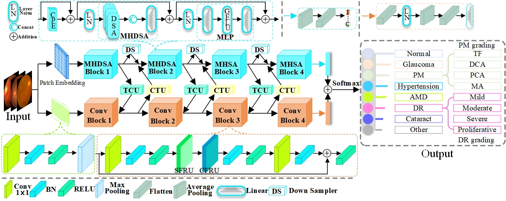

# MRDs-BBCIF-Net
Bi-Branch Bidirectional Coupled Interaction Fusion network for Multi-Retinal Diseases Diagnosis

---
# Abstract

Color fundus photography (CFP) serves as an effective screening tool for retinal disease (RD).
The advancement of artificial intelligence (AI) technologies has significantly 
improved the ability to identify RD based on CFP. 
However, most existing AI-assisted models are tailored specifically to a single
RD and are developed using private and single-source datasets.
This results in limited generalizability, posing challenges in achieving reliable 
recognition and classification of multiple retinal diseases (MRDs) in real-world
clinical practice. To tackle these issues, we collect 16 public CFP datasets, 
covering 16 retinal conditions. The inherent diversity introduced by multi-source
MRD datasets presents substantial challenges for feature extraction in MRD diagnostics, 
thereby constraining its clinical applicability. We propose the Bi-Branch bidirectional 
coupled interaction fusion network (BBCIF-Net) for MRD diagnosis. 
The concurrent dual-branch architecture in BBCIF-Net effectively integrates the
local features from convolutional neural networks with the global representation 
provided by transformers. Consequently, it enhances the multi-fold feature 
extraction capabilities for MRD. The coupling interaction between the dual branches 
occurs across multiple feature spaces, facilitated by the bidirectional feature 
coupling unit. Additionally, we adopt redundant feature elimination strategies 
in both branch networks. This approach not only enables the model to better focus 
on combining key characteristics of the diseases but also compresses the model’s 
parameters to a certain extent. The comprehensive experimental results demonstrate 
the effectiveness of the proposed method in MRD identification and two disease 
grading tasks.


---

# Citation
```
@article{CHEN2025114069,
title = {Bi-branch bidirectional coupled interaction fusion network for multi-retinal diseases diagnosis},
journal = {Knowledge-Based Systems},
volume = {326},
pages = {114069},
year = {2025},
issn = {0950-7051},
doi = {https://doi.org/10.1016/j.knosys.2025.114069},
url = {https://www.sciencedirect.com/science/article/pii/S0950705125011141},
author = {Shaobin Chen and Tao Tan and Xinyu Zhao and Wei Ke and Xiayu Xu and Yanwu Xu and Guoming Zhang and Chan-Tong Lam and Yue Sun},
}
```